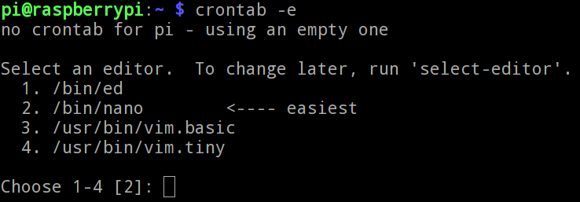
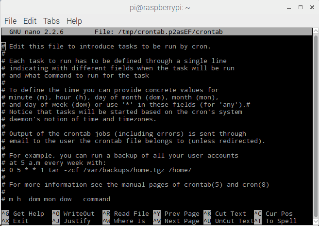

### Automating Scripts with Crontab

Sometime you don't want to manually start a script that you have written manually. What you need is for the script to run once every hour, or maybe once every thirty seconds, or every time your computer starts. On *nix systems this is a fairly easy task, using a program called **Cron**. Cron will run any command it is told to, at certain times, by referencing what is known as the **cron table** which is normally abbreviated to **crontab**.

*[*nix]: Computers running a *UNIX-like* operating system. (MacOS or GNU/Linux)

#### Editing the crontab

1. To open the crontab, you first need to open a Terminal. Then you can type:

	~~~bash
	crontab -e
	~~~

1. The `-e` in this command is short for *edit*. If this is your first time opening your crontab then you'll be asked which text editor you would like to use.

	
	
1. Unless you have plenty of experience using **ed** or **vim**, the simplest editor to use is **nano**, so type `2` to choose it and press **Enter**.

	
	
1. Nano is a simple command line text editor. If you want to learn more about using nano then you can have a look at [this resource](link-to-nano-resource).

*[command line]: A way of interfacing with your computer using text commands.
*[text editor]: A program for reading and editing text files.

#### Syntax for cron

The crontab contains all the basic information you need to get started. Each line starts with a `#` which is a comment, and so ignored by the computer. At the bottom of the crontab you should see a line that looks like this:

```bash
# m h  dom mon dow   command
```

- `m` is short for **minute**
- `h` is short for **hour**
- `dom` is short for **day of the month**
- `mon` is short for **month**
- `dow` is short for **day of the week**
- `command` is the bash command that you want to run

#### Creating a new cron job

To create a cron job you need to decide under which circumstances you would like it to run. For instance, If you wanted to run a Python script every 30 minutes you would write the following:

```bash
30 * * * * python3 /home/pi/my_cool_script.py
```

The `30` is telling the script to run every 30 minutes. The asterisks are there to say that the script needs running for all **legal values** for the other fields.

Here are a few more examples.

| What will happen...                              | crontab syntax                    |
|--------------------------------------------------|-----------------------------------|
| Run a script at 11:59 every Tuesday              | 59 11 * * 2 python3 /home/pi/my_script.py  |
| Run a script once a week on Monday               | 0 0 * * 1 python3 /home/pi/my_script.py    |
| Run a script at 12:00 on the 1st of Jan and June | 0 12 1 1,6 * python3 /home/pi/my_script.py |

#### Run on boot
One incredibly useful feature of cron, is the ability to run a command when the computer boots up. To do this, you use the `@reboot` syntax. For instance:

```bash
@reboot python3 /home/pi/my_cool_script.py
```

#### Edit and Save the file.
You can add in your cron job to the bottom of the crontab. Then save and exit nano by pressing **Ctrl + x** and then typing **y** when you are prompted to save. 
